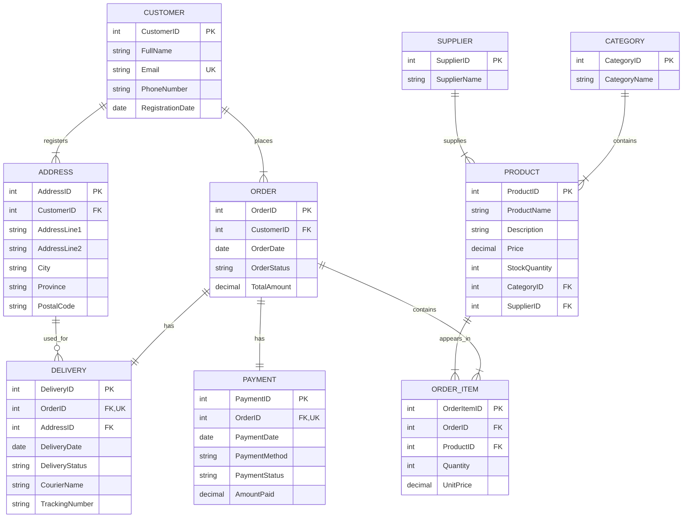

# WitleShop ERD

## Entity-Relationship Diagram

## Cardinality notes

- One customer registers one or more addresses.
- One customer places one or more orders.
- One category contains one or more products.
- One supplier supplies one or more products.
- One order contains one or more order items.
- One product can appear in zero or many order items.
- Order and Product are therefore M:N through OrderItem.
- Each order has exactly one payment and each payment belongs to exactly one order.
- Each order has exactly one delivery and each delivery belongs to exactly one order.
- A registered address can be used for zero or many deliveries.
